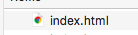

<p align=center>
  
</p>


# guia html e css


O html e css são a base da programação web, são eles que estruturam, dam forma e estilo para todos os sites e sistemas web, 
por causa disso é muito importante ter conhecimento sobre essas tecnologias. Mas o que é realmente html e css ?

## O html

O html ( HyperText Markup Language ) é uma tecnologia conhecida como linguagen de marcação, além disso é a responsavel pela estrutuara da pagina web, aqui esta um exemplo do que tem dentro de um arquivo html:

```html
<!DOCTYPE html>
<html>
    <head>
        <meta charset="utf-8" />
        <meta name="description" content="a descrição do seu site em no máximo 90 caracteres">
        <meta name="keywords" content="escreva palavras-chaves curtas, máximo 150 caracteres">
        <title>Título do Documento</title>
    </head>
    <body>
      <!-- Aqui fica a página que será visível para todos, onde pode-se inserir
      textos, imagens, links para outras páginas, etc, geralmente usa-se: -->

      <div>Tag para criar-se uma 'caixa', um bloco, mais utilizada com "Cascading Style Sheets
           (Folhas de Estilo em Cascata)</div>

      <span>Tag para modificação de uma parte do texto da página</span>

      

      <a href="http://www.wikipedia.org">Wikipedia, A Enciclopédia Livre</a>
    </body>
</html>
```

Calma! calma! pode parecer uma língua alienígena no começo, mas se olharmos com mais atenção iremos ver que não existe nada de complicado, essas coisa que estão entre sinal de maior que, e menor que, como por exemplo o  `` <body> `` são o que chamamos de tags, e é com essas tags que sabemos o que é cada coisa no site, por exemplo na tag `` <body> `` é onde colocamos todo o html responsavel pelo corpo do site, existem dezenas de tags html e se você estiver curioso é quiser saber um pouco mais sobre cada tag, pode clicar nesse link aqui [click aqui para saber mais](https://developer.mozilla.org/pt-BR/docs/Web/HTML/Element), mas se não estiver muito curioso, saiba que o html divide a pagina web em varias áreas diferentes, chamadas de tags e essas tags nós ajudam a estruturar partes expecificas do nossos site. 

## O css

O css ( Cascading Style Sheets ) é o que usamos para estilizar as nossas tags html, apos dividirmos a tela em varias tags diferentes usamos o css para conseguir dar tamanho, forma e cores diferentes a cada tag, 

### exemplo1

```html
<!DOCTYPE html>
<html lang="en">
<head>
    <meta charset="UTF-8">
    <meta name="viewport" content="width=device-width, initial-scale=1.0">
    <meta http-equiv="X-UA-Compatible" content="ie=edge">
    <title>Document</title>
</head>
<style>
    div {
        background-color: greenyellow;
        height: 100px;
        width: 100px;
    }
</style>
<body>
    <div> </div>
</body>
</html>
```
No exemplo acima temos um html com css e para entedermos melhor o css iremos olhar mais expicificamente a tag `` <style> `` que é onde colocamos o nossa estilização:

```html
<style>
    div {
        background-color: greenyellow;
        height: 100px;
        width: 100px;
    }
</style>
```
Detro da tag ``<style> `` temos: 
 
```css
 div {
        background-color: greenyellow;
        height: 100px;
        width: 100px;
    }
```
Apenas esse trecho de codigo é que chamanos de css, nele podemos notar algumas diferença como por exemplo as chaves ``{ ``  `` } `` onde é dentro dela colocamos algumas propiedades como largura (`` width ``), altura (`` heigth ``) e cor de fundo (``background-color``), é o nome que vem antes das chaves é o nome da tag html que estamos estilizando, nesse caso usamos a palavra div para estilizar a tag `` <div> ``, se copiarmos o codigo do exemplo1 e salvarmos em um arquivo que terminae com ``.html`` e depois clicarmos nele iremos abrir uma pagina no navegador que ira mostrar um quadrado verde com 100 pixels de altura e 100 pixels de largura:

#### Exemplo de arquivo 



#### Pagina web


       
